## TAREA DEL TEMA 6

**1. Crear en GitHub 1 repositorio, que puede ser el backend o el frontend de la aplicación desarrollada a lo largo del curso.**

Accedo a mi cuenta de GitHub. En la esquina superior derecha, pulsamos en el signo + y luego en New repository.

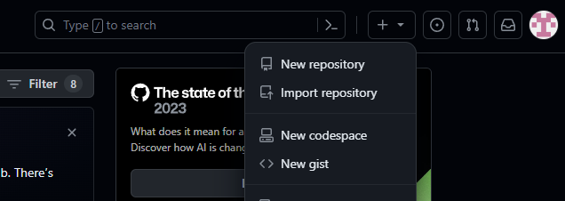

Escogemos el nombre del repositorio. No tiene por que coincidir con el nombre del repositorio local, aunque es lo aconsejable para no hacernos un lío. Una vez insertado el nombre le doy a “Create repository”.

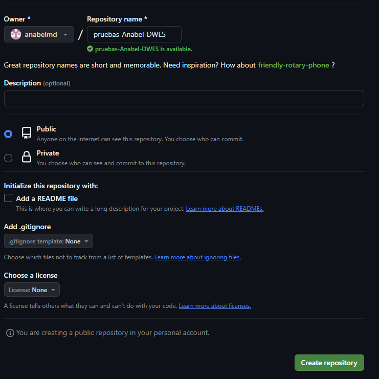

Ahora hay que asociar el repositorio local con el remoto. Dentro de nuestro repositorio local ejecutamos lo siguiente:

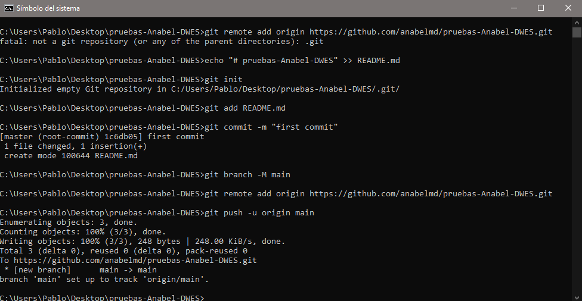

**2. Configurar una clave SSH para acceso desde casa. Si se considera necesario puede configurarse otra clave para el acceso desde el centro educativo.**
En mi caso yo ya lo tengo hecho en casa y en clase.

**3. El uso de los comandos más frecuentes de git.**

- git clone: Se utiliza para clonar un repositorio Git existente en un nuevo directorio. La sintaxis general es git clone <URL del repositorio>Ej:
  Copio el código del repositorio creado en git y lo clono en otra carpeta que acabo de crear en el escritorio.

  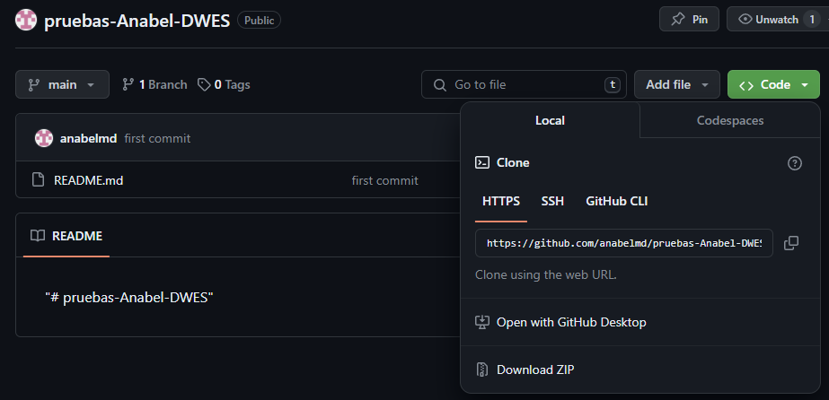

  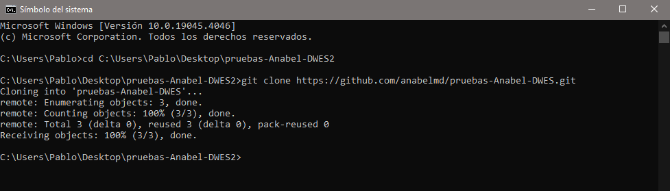

- git add: Este comando se utiliza para agregar archivos al área de preparación (staging area) para ser incluidos en el próximo commit. Puedes agregar archivos específicos (git add nombre_archivo) o todos los archivos cambiados (git add .).

  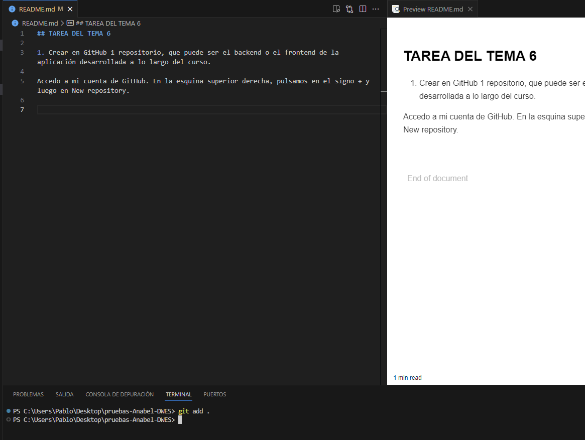

- git commit: Guarda los cambios realizados en el área de preparación en el repositorio. La sintaxis básica es git commit -m "Mensaje de commit", donde "-m" se utiliza para incluir un mensaje descriptivo sobre los cambios realizados.

  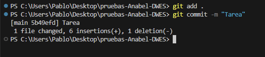

- git log: Muestra el historial de commits del repositorio. Proporciona información detallada sobre los commits, como el autor, la fecha y la descripción. Puedes usar diferentes opciones para personalizar la salida, como --oneline para una vista más compacta o --graph para visualizar el historial de commits como un gráfico.

  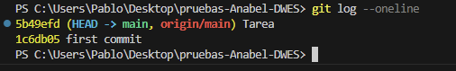

  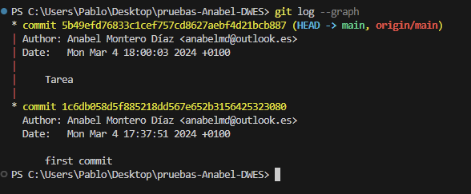

- git status: Proporciona información sobre el estado actual del repositorio. Muestra los archivos modificados, eliminados o nuevos, así como los archivos que están en el área de preparación. Es útil para verificar el estado de tu trabajo antes de realizar un commit.

  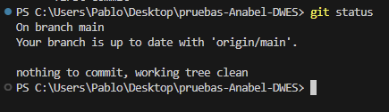

- git remote: Se utiliza para administrar las conexiones remotas al repositorio. Puedes ver las conexiones remotas existentes (git remote -v), agregar nuevas conexiones (git remote add <nombre> <URL>), eliminar conexiones (git remote remove <nombre>), entre otras operaciones relacionadas con repositorios remotos.

  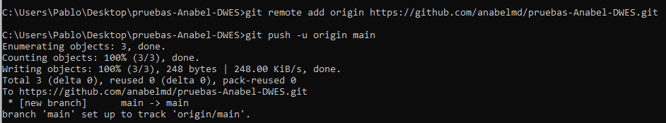

  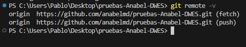

**4. El uso de comandos más avanzados.**

- git diff: Este comando muestra las diferencias entre el estado actual de los archivos en tu directorio de trabajo y el área de preparación (staging area) o el último commit. Puedes usarlo de varias maneras:

  Para mostrar las diferencias entre el directorio de trabajo y el área de preparación:
  Para mostrar las diferencias entre el área de preparación y el último commit-
  Para mostrar las diferencias entre dos commits específicos:

  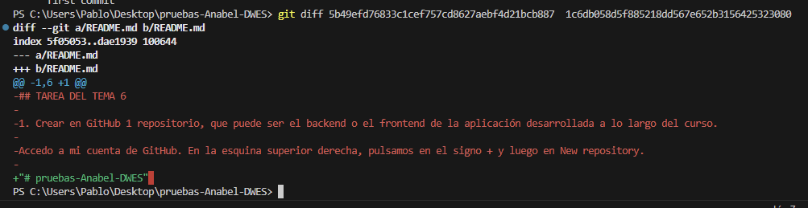

- git reset: : Este comando se utiliza para deshacer cambios. Puede deshacer cambios en el área de preparación o en el directorio de trabajo, y también puede mover la punta de la rama a un commit específico. Algunas formas comunes de usarlo incluyen.

  Voy a agregar un archivo al área de preparación y luego lo voy a deshacer.

  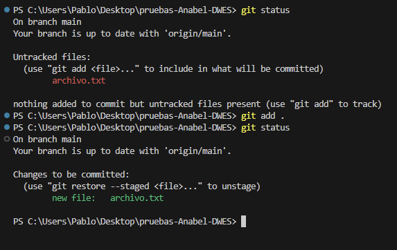

  Ahora utilizo el comando reset para quitar el archivo del área de preparación.

  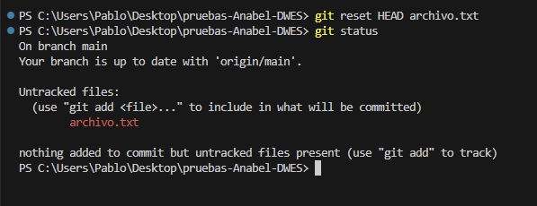

**5. El uso de Markdown para la documentación en el archivo README.md**

**6. En el trabajo deben aparecer las URLs del repositorio en GitHub.**

https://github.com/anabelmd/pruebas-Anabel-DWES
